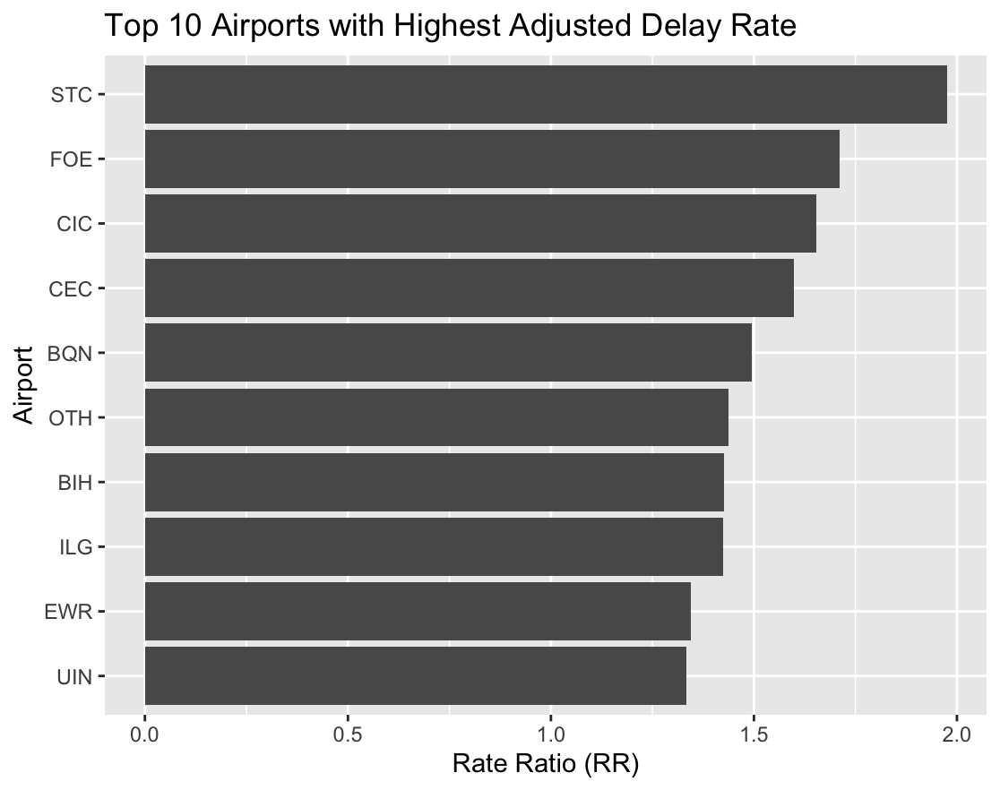
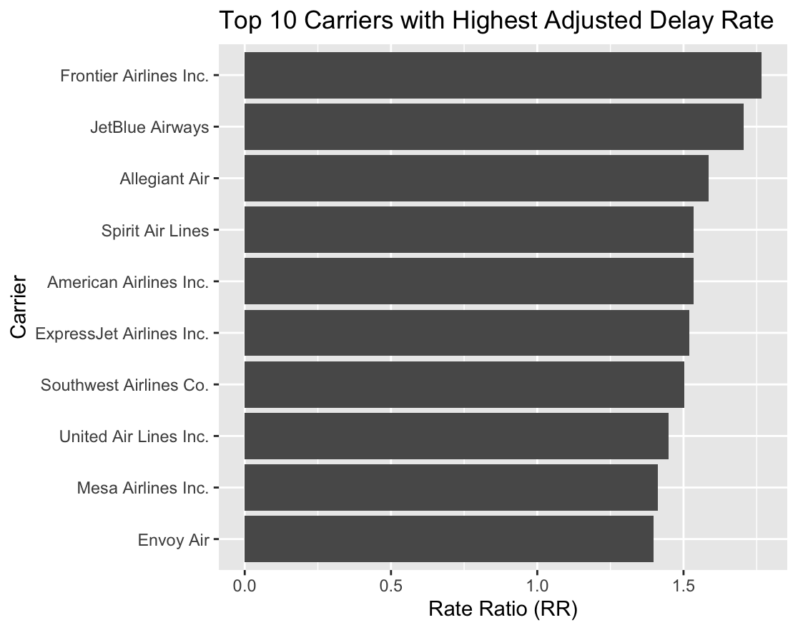

# Flight Delay Modeling (Poisson & Negative Binomial Regression in R)

## Project Overview

This project applies count regression techniques in R to model airline flight delays using real-world operational data.  
The objective is to model and interpret the number of delayed flights (15+ minutes) while accounting for exposure, seasonality, airport effects, and carrier effects.

---

## Dataset

Source: [Airline Delay Dataset](https://www.kaggle.com/datasets/sriharshaeedala/airline-delay)

### Key Variables
- arr_del15: Number of flights delayed ≥15 minutes
- arr_flights: Total arriving flights (exposure)
- month: Month of the year
- airport: Airport code
- carrier: Airline carrier code
- carrier_name: Airline name

---

## Research Questions

- How does month affect expected delay counts?
- Which airports systematically experience more or fewer delays?
- Which carriers have higher or lower delay rates after adjustment?

---

## Data Preparation

To ensure interpretability and statistical stability of the model coefficients, explicit baseline (reference) categories were set for key categorical variables. In count regression models with categorical predictors, all estimated coefficients are interpreted relative to a reference level. Without an intentional baseline choice, the default reference is chosen alphabetically, which can lead to unintuitive comparisons and misleading interpretations.

In this analysis, Atlanta (ATL) was selected as the baseline airport, Delta Air Lines (DL) as the baseline carrier, and January as the baseline month. These baselines were chosen because they represent high-volume, operationally stable references: ATL is the busiest airport in the dataset, Delta is a major full-service carrier with extensive operations, and January provides a natural temporal anchor at the start of the calendar year. As a result, all airport and carrier effects in the model should be interpreted as multiplicative changes in the expected number of delays relative to ATL and Delta, after controlling for exposure (number of arriving flights) and seasonality.

This baseline adjustment allows the estimated rate ratios to answer practical questions such as: “How does the expected delay rate at Airport X compare to ATL, given the same number of flights?” or “Does Carrier Y experience systematically higher delay rates than Delta, holding airport and month constant?”.

- Converted categorical variables to factors
- Labeled months using calendar abbreviations
- Removed missing values
- Filtered out low‑volume observations
- Set reference levels (ATL, DL, January)
- Train/test split (80/20)

---

## Modeling

Negative Binomial Regression with exposure offset:

arr_del15 ~ month + airport + carrier + offset(log(arr_flights))

Chosen due to overdispersion in the count outcome.

---

## Interpretation

Coefficients are interpreted using rate ratios:
- RR > 1: Higher delay rate
- RR < 1: Lower delay rate

---

## Key Findings

### Airports

After controlling for monthly seasonality, carrier effects, and flight volume via an exposure offset, substantial heterogeneity in delay rates across airports was observed. The worst-performing airports exhibited adjusted delay rates between 33% and nearly 100% higher than the baseline airport (ATL). Notably, airports such as STC (St. Cloud, MN) and FOE (Topeka, KS) showed the highest adjusted delay rates, indicating that flights arriving at these airports experience significantly more delays per arrival than comparable flights at ATL.

Conversely, the best-performing airports demonstrated markedly lower delay rates. Airports such as IYK (Inyokern, CA), SPN (Saipan, MP), and LWS (Lewiston, ID) exhibited delay rates 50–70% lower than the baseline. These results suggest that, even after accounting for traffic volume, certain airports consistently operate with substantially fewer delays, potentially due to lower congestion, favorable weather patterns, or simpler operational structures.

### Carriers

Carrier-level effects revealed systematic differences in delay performance after adjusting for airport, month, and exposure. Low-cost carriers such as Frontier (F9), JetBlue (B6), and Allegiant (G4) exhibited the highest adjusted delay rates, with expected delay counts 50–75% higher than Delta under comparable conditions. This pattern is consistent with tighter scheduling margins and higher sensitivity to operational disruptions.

In contrast, several carriers demonstrated relatively strong performance. Endeavor Air (9E) and Delta Air Lines (DL) served as the lowest-delay benchmarks in the model, with delay rates at or below the baseline. Regional and network-integrated carriers generally exhibited lower adjusted delay rates, suggesting that operational scale, hub integration, and recovery capacity play an important role in mitigating delays.

Overall, the results demonstrate that flight delays are not solely driven by traffic volume or seasonality. Even after accounting for exposure, month, and airport effects, both airport-specific and carrier-specific structural differences remain statistically and practically significant. The use of an explicit baseline and a Negative Binomial framework allows these differences to be interpreted in terms of relative risk (rate ratios), making the findings directly applicable to operational benchmarking and performance comparison.

---

## Tools

- R
- tidyverse
- caret
- MASS
- ggplot2

---

## Author

Sevban Ekşi (st3kin)  
2025
